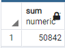

# Pewlett-Hackard-Analysis

# Overview of the analysis
- In this analysis we are assisting Pewlett Hackard a large company with thousands of employees. They will have a lot of employees retiring soon and need to prepare for the future. With many employees retiring they will need to fill those roles and to do so we will provide them with the total number of employees retiring by department and also providing them with a list of employees that are eligible for their mentorship program to help fill those roles as well. 

# Results
- As you can see in the screen shot below Pewlett Hackard will have a large amount of Senior Engineer and Senior staff retiring with each having over 20,000 employees. With these being very important roles this information is crucial to assist with preparing for the future. 

- After looking through the output from the retirement titles table I noticed that there is a few employees who have had multiple titles since joining the company. This tells me that Pewlett Hackard does a great job at training and moving their employees up to high positions. As you can see below employees like Chirstian, kyoichi, Sumant, nad Kazuhide all had multiple positions within the company showing they had growth. 

- By using the COUNT function on our mentorship eligibility table there is a total of 1,549 employees eligible for mentroship. 

- Our unique titles table shows the most recent title held by each employee that will be retiring.

# Summary
- As the "silver tsunami" begins to impact Pewlett Hackard there is a total of 72,458 roles that will need to be filled. 

- With this large amount of employees retiring from Pewlett Hackard training the next generation of employees will be vital. There is as total of 50,822 senior level employees retiring and they will need to rely on those empoloyeses to prepare new hires for the future.

